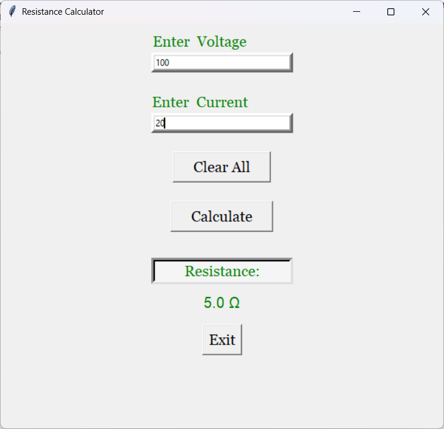

# Resistance Calculator GUI

This is a simple Python project that calculates the resistance of a circuit using user input for voltage and current. It uses a graphical user interface (GUI) built with `tkinter`.

## - Features -
- Super simple interface
- Calculates resistance using Ohm's Law (V/I)
- Handles errors like zero current and non-numeric input
- Has a Clear All button to reset inputs

## - Technologies Used -
- Python 3
- tkinter

## - Screenshot -

## - How to Run the Project -
1. Make sure Python 3 is installed on your computer.
2. Clone or download this repository.
3. Run the file.
   
## - Purpose -
This Resistance Calculator project reflects my passion for electronics and coding. It enabled me to apply Python programming to solve real-world circuit problems through a user-friendly GUI, effectively combining my programming skills with my interest in electrical circuits.
